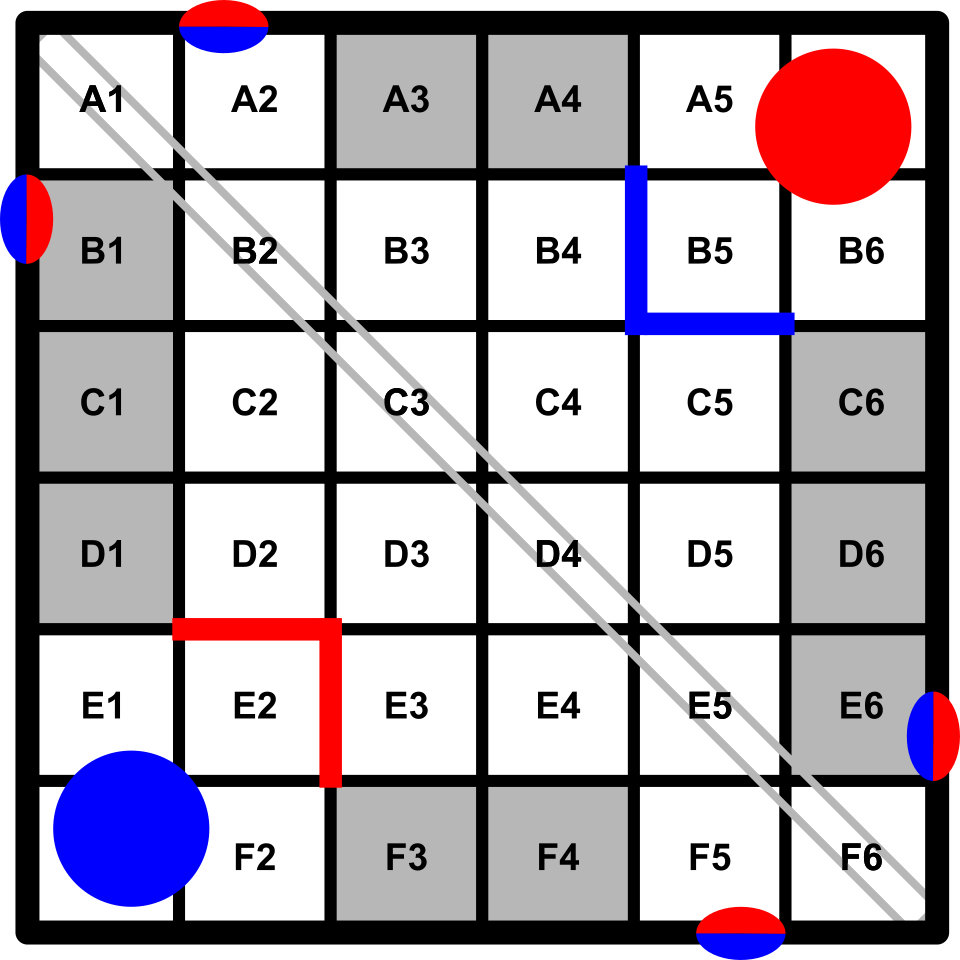

# Frilled Lizard <!-- omit from toc -->

UPDATE: This repository was archived on 3/8/2023, for more recent information please view [our website](https://beyond-reality-dev.github.io/Team-5588T/index).

This is the official repository of VEX Robotics Competition team 5588T. 

## Table of Contents <!-- omit from toc -->

- [Features](#features)
    - [Motor Toggles](#motor-toggles)
    - [Odometry](#odometry)
    - [Autonomous Selector](#autonomous-selector)
    - [Chessboard Pathfinding System](#chessboard-pathfinding-system)
    - [Automatic Roller](#automatic-roller)
- [Future Changes](#future-changes)
    - [Automatic Disc Shot](#automatic-disc-shot)
    - [Reversible Steering](#reversible-steering)

## Features

### Motor Toggles

The program includes the ability to toggle the intake and launcher systems on and off, rather than having to hold a button. This allows form more efficient use of the systems, and makes it easier for the driver to operate them.

### Odometry

The program utilizes the OkapiLib library to create an odometric chassis that uses the integrated encoders in the VEX V5 Smart Motors. This allows the robot to adjust to external stimuli and more accurately perform autonomous routines. It also enables the programming of motion directly to specific points, as opposed to distances.

### Autonomous Selector

The program implements the [VEX Autonomous Selector for PROS](https://github.com/kunwarsahni01/Vex-Autonomous-Selector), a tool that allows the simple configuration of a graphical menu to choose an autonomous before a competition match. The Autonomous Selector is also used by the program to configure the automatic roller, detailed below.

### Chessboard Pathfinding System

In order to allow non-programmers on the team to be able to program autonomous routines, I created a virtual "chessboard" for the game field. The system divides the field into tiles, and allows the robot to be driven directly to those positions. The syntax is similar to that of chess notation or battleship, and will hopefully make it easier for others to create and modify autonomous programs. A visual representation of the board is included below:

### Automatic Roller

The program uses a VEX Vision Sensor to detect the color of the bottom of the roller. If it detects that the color is different than the target color, which is the opposite of the alliance color, it will turn it in increments and repeatedly update the color. It will stop once it detects the desired color, or is interrupted by the controller.

## Future Changes

### Automatic Disc Shot

The program will also utilize the VEX Vision Sensor to both orient towards and calculate the distance to the target goal. It will do this by first identifying the largest object of the target color, which will be the desired goal, and then determine the current and necessary distance using trigonometry. This will also be implemented alongside the existing odometry system that will ensure accurate aiming. Given potential challenges with reliably targeting the goal, it is likely that this program will only be used during the autonomous portion.

### Reversible Steering

With a push of a button, the driver will be able to reverse the direction of controlling the robot. This is an idea I originally came up with for last year's game, but never fully implemented. It should help the driver to easily reorient themself and swap between turning a roller and picking up and shooting discs into the alliance high goal.
